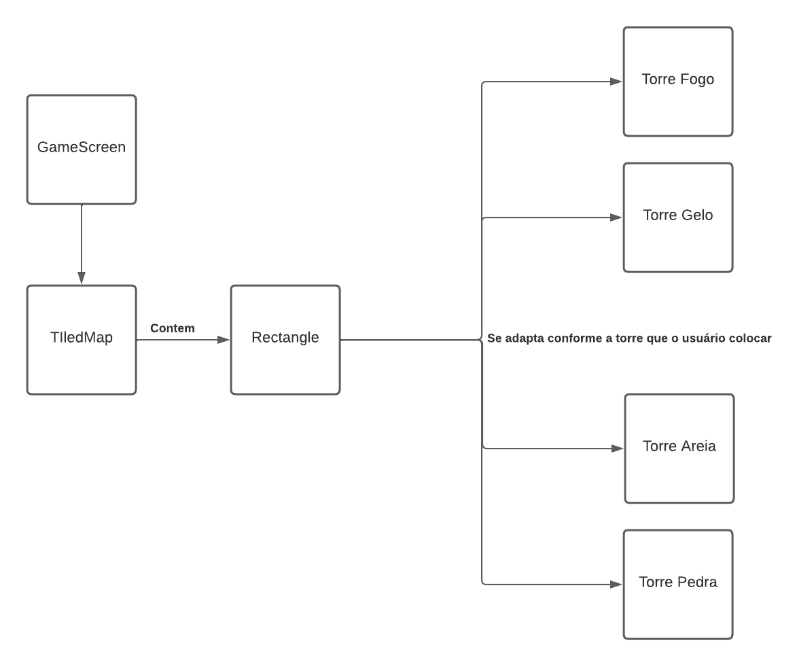

# Projeto `Tower Defense`

# Descrição Resumida do Projeto/Jogo
O jogo consiste em um arcade do tipo TowerDefense, em que o jogador deve enfrentar hordas de inimigos e impedir que cheguem em seu tesouro. Para fazer isso, ele pode
comprar torres de defesa, que nesse jogo são representados como Golems, e elas irão atacar os inimigos. Ouro é ganho a cada inimigo morto e é usado para comprar mais
torres. Assim, o jogador  deve  sobreviver 10 ondas e derrotar 2 inimigos do tipo Boss para vencer.

# Equipe
* `Gustavo Molino Teixeira Alves` - `247144`
* `Rodrigo Botelho Zuiani` - `245244`

# Arquivo Executável do Jogo

[Executável](https://github.com/Grupo-Gustavo-Rodrigo-lab05/TrabPOO/blob/main/src/TrabPOO/desktop/build/libs/desktop-1.0.jar)

# Slides do Projeto

## Slides da Prévia
[Slides Prévia](https://github.com/Grupo-Gustavo-Rodrigo-lab05/TrabPOO/blob/main/assets/ApresentaçãoPrévia.pptx)

## Slides da Apresentação Final
[Slides Final](https://github.com/Grupo-Gustavo-Rodrigo-lab05/TrabPOO/blob/main/assets/ApresentaçãoFinal.pptx)

## Relatório de Evolução

O grupo inicialmente planejava montar um jogo que apresentaria, além de um tower defense padrão, um diferencial no qual seriam apresentadas cartas que mudariam aspectos do jogo a cada rodada, por meio de um sorteio. Contudo essa ideia foi descartada devido ao tempo para implementação do jogo, a fim de manter um jogo de tower defense mais simples porém mais consistente.  
	Primeiramente, buscamos montar uma arquitetura para o jogo, para que pudéssemos visualizar uma separação consistente entre o Frontend e o Backend, de modo que pudéssemos trabalhar com ambos separadamente. Contudo, para a implementação do frontend o grupo obteve a maior dificuldade, pois ambos tinham pouquíssimo conhecimento quanto a interfaces gráficas funcionais e interações com o usuário.  
	Buscamos então aprender sobre interfaces gráficas e métodos de implementação das mesmas sob um jogo. Depois de uma longa pesquisa, decidiu-se usar a framework libgdx para cuidar da parte gráfica do jogo de modo a facilitar a implementação do mesmo. Com isso, separamos como frontend a apresentação gráfica e interações no jogo e como backend o funcionamento consistente do jogo e lógicas do sistema em geral.  
	Ambos os membros do grupo buscaram então ler toda a documentação do Libgdx a fim de aprender os métodos, classes e estruturas da framework. Em meio às pesquisas, obtivemos conhecimento do sistema de TiledMap, que poderia se integrar facilmente ao Libgdx a fim de gerar e renderizar mapas de modo mais fácil, logo, facilitando a apresentação do jogo e deixando mais tempo para focarmos na orientação a objetos e lógica do jogo.  
	Iniciamos então a implementação do jogo, aplicando os conceitos básicos do Libgdx e criando as primeiras screens, cameras, batchs, etc. Após isso, iniciamos a criação do mapa do jogo pelo TiledMap, a fim de criar um plano de fundo para cada uma das screens que seriam renderizadas. Assim, criamos toda a parte de visualização básica do jogo, com a construção dos menus e do mapa.  
	Tendo feito isso, partimos para a criação do Backend do jogo, de modo a integrar a parte gráfica feita com o funcionamento, propriamente dito, do jogo. Assim, utilizando nossa arquitetura inicial, criamos e interfaces previstas como Sala, Inimigo e Efeito, e a classe Mapa, implementando seus funcionamentos conforme previsto na arquitetura e mantendo os padrões de encapsulamento que buscamos manter no nosso sistema, ou seja, a estrutura Interface, Classe Abstrata, Classes Herdeiras.  
	Com a implementação da parte básica do Backend, partimos para os primeiros conceitos das nossas lógicas e da integração do Backend com o Frontend. Desse modo, decidimos representar cada uma das salas por um retângulo criado no TileMap, e associando cada sala ao seu respectivo retângulo no mapa. Desse modo, agora a sala saberia suas próprias coordenadas e poderia interagir com o mapa.  
	Agora, com as screens funcionando e as salas integradas ao frontend, buscamos implementar a parte realmente jogável do jogo, ou seja, o spawn de inimigos e os efeitos gerados pelas torres. Desse modo, assim como nas salas, associamos um retângulo para cada inimigo e para cada torre. Vale ressaltar que, usando o Adapter Pattern, pudemos inserir qualquer tipo de inimigo ou torre nas salas, pois são todos retângulos que podem guardar qualquer tipo de torre ou inimigo.  
	Na arquitetura inicial, já imaginávamos que as torres gerariam efeitos nas salas e, portanto, implementamos esse sistema, para que as torres inseridas nos respectivos locais gerassem efeitos nas ‘SalaCaminho’ adjacentes a elas. Simultaneamente, implementamos a movimentação dos inimigos pelo mapa, ainda sem tomar dano, de modo que eles conseguissem buscar chegar ao fim do mapa sozinhos.  
	Após o funcionamento das torres, efeitos e inimigos, inserimos finalmente a interação das torres com os inimigos. De modo que optamos por deixar que a sala fizesse essa conexão, ou seja, uma sala recebe um efeito de uma torre e contém um inimigo. Desse modo, ela gera o efeito no inimigo enquanto este estiver sob ela.
	Com a implementação funcional de todos os fatores acima, tínhamos apenas uma torre e um inimigo no jogo, de modo que passamos a diversificar o número e variedade de inimigos, torres e ondas. Implementando inimigos mais fortes a cada onda e “chefões” em certos níveis específicos, além de criarmos mais 3 tipos de torres com diferentes poderes e custos. Como usamos o Adapter Pattern, inserir novos monstros ou torres foi especialmente fácil, bastando criar uma classe que estendesse a classe abstrata geral.  
	Com o jogo em pleno funcionamento, criamos sistemas mais específicos do jogo, como o funcionamento da tela de pause, correção de tempo de spawn de inimigos para quando o jogador abre o mercado, e inserção de um tutorial, para que o jogador entendesse o funcionamento do jogo.

# Destaques de Código

Implementação do Pause no jogo na classe GameScreen
~~~java
//Administra o estado do jogo (Pause)
if(paused) {
    batch.draw(pauseImg, 512, 512);
    if(!tutorial) {
	if (Gdx.input.isKeyJustPressed(Input.Keys.P) || fechouMercado) {
	    timePausedDelay = TimeUtils.nanoTime() - instantPaused;
	    paused = false;
	    fechouMercado = false;
	}
    }
    else{
    ...
    }
}
else {
    generalUpdate();
}
~~~
~~~java
//Pausa o jogo quando o usuário aperta 'P'
if (Gdx.input.isKeyJustPressed(Input.Keys.P)) {
    instantPaused = TimeUtils.nanoTime();
    paused = true;
}
~~~

O tempo marcado quando o jogo é pausado serve para compensar quando calculamos o intervalo de spawn de inimigos
~~~java
//Spawn de inimigos
if ((TimeUtils.nanoTime() - timePausedDelay) - lastDropTime > 1000000000 && !trocouOnda) {
    spawnEnemies();
    timePausedDelay = 0;
}
~~~

Fim do jogo no caso de derrota
~~~java
//Termina o jogo se um inimigo chegou no tesouro
for (Iterator<InimigoBasico> it = enemies.iterator(); it.hasNext();) {
    InimigoBasico enemy = it.next();
    if(enemy.getRec().y < 130 && enemy.getRec().x > 380) {
	try {
	    Thread.sleep(500);
	} catch (InterruptedException e) {
	    System.out.println(e);
	}
	game.setScreen(new LoseScreen(game, mapa));
    }
}
~~~

Inimigos da próxima onda só aparecem quando o último inimigo da última onda morre, e fim do jogo no caso de vitória
~~~java
//Retoma o spawn de inimigos quando o último inimigo da última onda morre
if (enemies.isEmpty() && !tutorial) {
    ondasI++;
    trocouOnda = false;
    if (ondasI == 10) { //Se o último boss morreu vence o jogo
	try {
	    Thread.sleep(1000);
	} catch (InterruptedException e) {
	    System.out.println(e);
	}
	game.setScreen(new WinScreen(game, mapa));
    }
}
~~~

# Destaques de Orientação a Objetos
Buscamos durante todo o código usar polimorfismo de modo que, Salas, inimigos e efeitos possuem todos um interface e uma classe abstrata, desse modo, declaramos sempre apenas a classe abstrata e instanciamos o objeto em um dos filhos de modo espeficico.
Exemplo de declaração abstrata das salas:
Imagem que mostra organização das classes com Interface-Classe abstrata(Implementa Interface)-Classes filhas( Extendem a abstrata)

## Diagrama de Classes usada no destaque OO:

## Código do Destaque OO
~~~java
public Mapa() {
        this.salas = new SalaBasica[9][5];

        //Gera uma matriz de salas que será o mapa no BackEnd
        for (int i = 0; i < 7; i++)
            for (int j = 0; j < 5; j++)
                if (i == 1 || i == 3|| i == 5) {
                    if (j == 1 || j == 3)
                        salas[i][j] = new SalaTorre(i, j, new TorreVazia(i, j));
                    else if ((j == 2 || j == 4) && (i == 1 || i == 5))
                        salas[i][j] = new SalaPedra(i, j);
                    else if ((j == 0 || j == 2) && i == 3)
                        salas[i][j] = new SalaPedra(i, j);
                    else
                        salas[i][j] = new SalaCaminho(i, j);
                }
                else
                    salas[i][j] = new SalaCaminho(i, j);
    }
~~~
Sala declarando seus efeitos e inimigos
~~~java
public class SalaCaminho extends SalaBasica {
    private Array<InimigoBasico> enemies;
    protected EfeitoBasico[] efeitos;
    public SalaCaminho(int x, int y) {
        super(x, y);
        enemies = new Array<InimigoBasico>();
        tipo = 'C';
        this.efeitos = new EfeitoBasico[2];
        for(int j = 0; j < 2; j++)
            efeitos[j] = null;
    }
~~~~

# Destaques de Pattern
Os principais Patterns adotados pela equipe foram o Observer Pattern e o Adpater Pattern

## Diagrama do Pattern
Observer Pattern para salas e inimigos

Observer Pattern para torres

Adapter Pattern Inimigos

Adapter Pattern torres

## Código do Pattern
Código do Observer Pattern para dar dano nos inimigos - A gameScreen fica o tempo todo verificando a posição dos inimigos vs a posição das salas. Caso ocorra sobreposição ela chama o método darDano da sala e dá dano nos inimigos.
~~~java
for (int linha = 0; linha < 7; linha ++) {
            for (int coluna = 0; coluna < 5; coluna++) {
                if(mapa.getSalas(linha, coluna).getTipo() == 'C') {
                    for (Iterator<InimigoBasico> it = enemies.iterator(); it.hasNext();) {
                        InimigoBasico enemy = it.next();
                        if (mapa.getSalas(linha, coluna).getRec().contains(enemy.getRec().x, enemy.getRec().y)) {
                            mapa.getSalas(linha, coluna).adicionaInimigo(enemy);
                            mapa.getSalas(linha, coluna).darDano();
                            if(enemy.morre()) {
                                it.remove();
                                enemy.getImagemInimigo().dispose();
                                ouro += enemy.getGoldDrop();
                            }
                        }
                        else {
                            mapa.getSalas(linha, coluna).removeInimigo(enemy);
                        }
                    }
                }
            }
        }
~~~
Codigo do Observer Pattern para torres - A GameScreen Verifica o tempo todo a torre que está contida naquela sala e aplica os efeitos decorrentes dessa torre.
~~~java
for (int i = 0; i < 7; i++) {
            for (int j = 0; j < 5; j++) {
                if(mapa.getSalas(i, j).getTipo() == 'T') {
                    if (mapa.getSalas(i, j).getTorre().getTorreTipo() != 'V') {
                        for (int m = -1; m <= 1; m++) {
                            for (int z = -1; z <= 1; z++) {
                                if (mapa.getSalas(i + m, j + z).getTipo() == 'C' && Math.abs(m) != Math.abs(z)) {
                                    mapa.getSalas(i + m, j + z).adicionaEfeito(mapa.getSalas(i, j).getTorre().getEfeitoTorre());
                                    batch.draw(mapa.getSalas(i, j).getTorre().getEfeitoTorre().getImagemEfeito(), mapa.getSalas(i + m, j + z).getRec().x, mapa.getSalas(i + m, j + z).getRec().y);
                                }
                            }
                        }
                        ...
~~~
Código do Adapter Inimigos - Note que primeiro declaramos o Rectangle, e depois aplicamos a ele determinado inimigo especifico, sendo que qualquer inimigo pode se adaptar a ele.
~~~java
for (MapObject object : tiledMap.getLayers().get("Spawn").getObjects()) {
                Rectangle Spawn = ((RectangleMapObject) object).getRectangle();
                InimigoBasico enemy;
                if (ondas[ondasI][ondasJ] == 'F')
                    enemy = new InimigoFaca();
                else if (ondas[ondasI][ondasJ] == 'M')
                    enemy = new InimigoMorcego();
                else if (ondas[ondasI][ondasJ] == 'A')
                    enemy = new InimigoArmadura();
                else if (ondas[ondasI][ondasJ] == 'O')
                    enemy = new InimigoOgro();
                else if (ondas[ondasI][ondasJ] == 'G')
                    enemy = new InimigoGolem();
                else
                    enemy = new InimigoEsqueleto();
~~~

Código do Adapter Torres - Note que cada sala se associa a um Rectangle, e qualquer torre pode se adaptar nesse Rectangle, dependendo apenas da torre que está contidade dentro da sala
~~~java
for (int i = 0; i < 7; i++) {
                for (int j = 0; j < 5; j++) {
                    if (mapa.getSalas(i, j).getTipo() == 'T' && mapa.getSalas(i, j).getTorre().getTorreTipo() != 'V') {
                        batch.draw(mapa.getSalas(i, j).getTorre().getImagemTorre(), mapa.getSalas(i, j).getRec().x, mapa.getSalas(i, j).getRec().y);
                    }
                }
            }
~~~

# Conclusões e Trabalhos Futuros

Por fim, o grupo concluiu que conseguimos entregar um jogo satisfatório, atendendo quase completamente nossa proposta inicial. Reconhecemos que, dado mais tempo, poderíamos ter dedicado mais à aparência do jogo, deixando certas partes mais bonitas e implementando telas adaptáveis à opção de tela cheia, que é algo que nós aprendemos a fazer mas não tivemos tempo suficiente para implementar.  
Além disso, conforme trabalhávamos com a framework libgdx, adquirimos certos entendimentos e conhecimentos que, caso tivéssemos antes, poderíamos ter deixado nossa arquitetura mais elegante. O principal exemplo disso é o caso da separação entre as partes View e Controller do nosso projeto. Primeiramente, implementamos nossas Screens de modo que elas mesmas são responsáveis por monitorar e controlar as ações do jogador na tela, além do funcionamento geral do jogo, já que essa é a maneira mais simples de implementar uma tela pelo libgdx. Porém, aprendemos posteriormente que é possível criar classes que vão agir como controladores das Screens, e elas é que ficam responsáveis por administrar as ações do usuário e o decorrer do jogo. Desse modo, podemos definir mais claramente e separar melhor a View e o Controller em nossa arquitetura. Porém, ao termos feito essa descoberta, não tínhamos tempo de implementar a mudança, mas esse seria o principal ponto a melhorar para um futuro projeto.  
Por fim, gostaríamos também de termos elaborado melhor a parte de tratamento de exceções em nosso projeto. Como essa foi uma das últimas matérias aprendidas em sala, reconhecemos sua importância mas não conseguimos trabalhá-la conforme desejado. Assim, esse seria um ponto crucial de aprimoração em futuros projetos.

# Documentação dos Componentes

# Diagramas

## Diagrama Geral da Arquitetura do Jogo

## Diagrama Geral de Componentes

Observa-se que possuimos 4 componentes independentes que se comunicam por meio de interfaces. A sala interagem com as torres e inimigos, enquanto que apenas a torre sabe o efeito que ela mesmo gera, interagindo com o efeito.

## Componente `Salas`
Representa as salas do jogo, implementando a interface Sala, e com uma classa abstrata SalaBasica representando uma classe geral que será herdada por salas especificas(Caminho, Torre, pedra). Cada sala é responsavel por saber quais itens estão contidos nela (Inimigos, Efeitos e torres).

**Ficha Técnica**
item | detalhamento
----- | -----
Classe |  `com.mygdx.game.Salas.SalaBasica`
Interfaces | `Sala`

### Interfaces
`Sala`

## Detalhamento da Interface

### Interface `Sala`

`Interface Responsável por declarar mátodos públicos das salas`

~~~java
//Interface contendo todos os métodos de uma Sala que são 'public' (podem ser acessados de fora)
public interface Sala {
    //Métodos gerais
    int getX();
    int getY();
    char getTipo();
    Rectangle getRec();
    void setRec(Rectangle rec);

    //Métodos SalaCaminho
    void adicionaEfeito(EfeitoBasico efeito);
    void removeEfeito(EfeitoBasico efeito);
    void adicionaInimigo(InimigoBasico inimigo);
    void removeInimigo(InimigoBasico enemy);
    void darDano();

    //Métodos SalaTorre
    TorreBasica getTorre();
    void setTorre(TorreBasica torre);
}
~~~

Método | Objetivo
-------| --------
`getX` | `Retorna a posição X(int) da sala na matriz de salas`
`getY` | `Retorna a posição Y(int) da sala na matriz de salas`
`getTipo` | `Retorna um char que representa o tipo da sala`
`getRec` | `Retorna o retângulo associado a essa sala`
`setRec` | `Atribui um retângulo à sala, com posições x e y passadas`
`adicionaEfeito` | `Adiciona um objeto do tipo EfeitoBasico à sala`
`removeEfeito` | `Remove da sala o objeto EfeitoBásico específico passado`
`adicionaInimigo` | `Adiciona um objeto do tipo InimigoBasico à sala`
`removeInimigo` | `Remove da sala o objeto InimigoBasico específico passado`
`darDano` | `Aplica o dano do efeito que está na sala à todos os inimigos nessa sala`
`getTorre` | `Retorna a TorreBasica que está contida nessa sala`
`setTorre` | `Atribui uma TorreBasica à sala`

## Componente `Inimigos`
Representa os inimigos do jogo, implementando a interface Inimigo, e com uma classe abstrata InimigoBasico que pode ser herdado por classes que representam inimigos especificos, cada um com seus respectivos atributos(vida e velocidade) e imagem gráfica.

**Ficha Técnica**
item | detalhamento
----- | -----
Classe | `com.mygdx.game.Inimigos.InimigoBasico`
Interfaces | `Inimigo`

### Interfaces
`Inimigo`

## Detalhamento da Interface

### Interface `Inimigo`

`Interface Responsavel por declarar metodos publicos dos inimigos`

~~~java
//Interface contendo todos os métodos de um Inimigo que são 'public' (podem ser acessados de fora)
public interface Inimigo {
    //Métodos gerais
    int getVelocidade();
    int getGoldDrop();
    void recebeDano(float dano);
    boolean morre();
    Rectangle getRec();
    void setRec(float x, float y);
    Texture getImagemInimigo();
    void create();
}
~~~

Método | Objetivo
-------| --------
`getVelocidade` | `Retorna um valor inteiro que representa a velociade desse inimigo`
`getGoldDrop` | `Retorna um valor inteiro que representa a quantidade de ouro que esse inimigo dá ao morrer`
`recebeDano` | `Subtrai da vida do inimigo o valor em float passado`
`morre` | `Retorna true caso a vida do inimigo seja menor que zero, e false caso contrário`
`getRec` | `Retorna o retângulo associado a esse inimigo`
`setRec` | `Atribui um retângulo ao inimigo, com posições x e y passadas`
`getImagemInimigo` | `Retorna um objeto do tipo Texture com a imagem do inimigo`
`create` | `Cria o objeto Texture com o caminho da imagem do inimigo`

## Componente `Torres`
Possui uma interface torre que é implementada por uma classe abstrata TorreBasica que é herdada por classes que representam torres especificas, com seus respectivos 
efeitos e a imagem gráfica da torre.

**Ficha Técnica**
item | detalhamento
----- | -----
Classe | `com.mygdx.game.Torre.TorreBasica`
Interfaces | `Torre`

### Interfaces
`Torre`

## Detalhamento da Interface

### Interface `Torre`

`Interface Responsavel por declarar metodos publicos das torres`
~~~java
//Interface contendo todos os métodos de uma Torre que são 'public' (podem ser acessados de fora)
public interface Torre {
    //Métodos gerais
    int getX();
    int getY();
    char getTorreTipo();
    EfeitoBasico getEfeitoTorre();
    Texture getImagemTorre();
    void create();
}
~~~

Método | Objetivo
-------| --------
`getX` | `Retorna a posição X(int) da torre na matriz de salas`
`getY` | `Retorna a posição Y(int) da torre na matriz de salas`
`getTorreTipo` | `Retorna um char que representa o tipo da torre (Fogo, Gelo, etc)`
`getEfeitoTorre` | `Retorna o objeto EfeitoBasico contido nessa torre`
`getImagemTorre` | `Retorna um objeto do tipo Texture com a imagem da torre`
`create` | `Cria o objeto Texture com o caminho da imagem da torre`

## Componente `Efeitos`
Possui uma interface Efeito que é implementada por uma classe abstrata EfeitoBasico que é herdado por classes que representam efeitos especificas, cada um com seu respectivo dano e imagem gráfica do efeito

**Ficha Técnica**
item | detalhamento
----- | -----
Classe |  `com.mygdx.game.Efeito.EfeitoBasico`
Interfaces | `Efeito`

### Interfaces
`Efeito`

## Detalhamento da Interface

### Interface `Efeito`

`Interface Responsavel por declarar metodos publicos dos efeitos`
~~~java
//Interface contendo todos os métodos de um Efeito que são 'public' (podem ser acessados de fora)
public interface Efeito {
    //Métodos gerais
    int getId();
    float getDano();
    Texture getImagemEfeito();
    void create();
}

~~~

Método | Objetivo
-------| --------
`getId` | `Retorna um valor inteiro que representa o tipo desse efeito`
`getDano` | `Retorna um valor float que representa o dano desse efeito`
`getImagemTorre` | `Retorna um objeto do tipo Texture com a imagem do efeito`
`create` | `Cria o objeto Texture com o caminho da imagem do efeito`

## Componente `Screens`
Possui uma interface Screen que faz parte do framework do libgdx e controla todas as telas do jogo que serão utilizadas pelo game(Renderizador). Possui a GameScreen, MercadoScreen, LoseScreen e WinScreen
**Ficha Técnica**
item | detalhamento
----- | -----
Classe |  `com.mygdx.game.Screens`
Interfaces | `Screen`

### Interfaces
`Screen`

## Detalhamento da Interface

### Interface `Screen`

`Interface do próprio Framework Ligbdx`

# Plano de Exceções

Como explicado na conclusão, não tivemos tempo para elaborar um sistema de tratamento de exceções em nosso projeto. Os únicos momentos em que usamos exceções foi nos pontos em que precisávamos aplicar um Thread.sleep() no jogo, pois esse método aplica uma InterruptedException se ele detecta que a Thread atual foi interrompida.
~~~java
try {
   Thread.sleep(500);
} catch (InterruptedException e) {
   System.out.println(e);
}
~~~~

